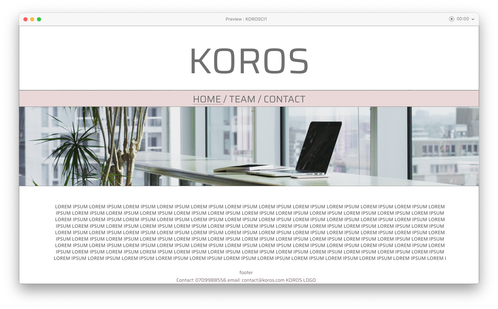
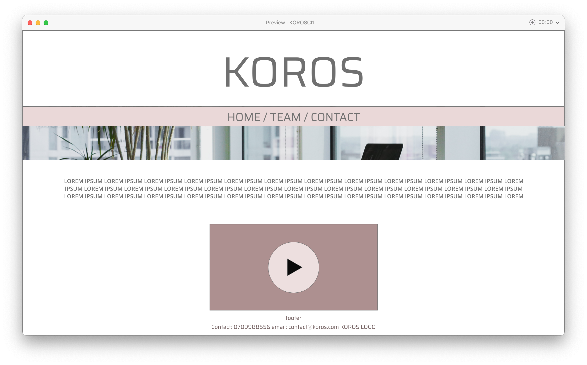
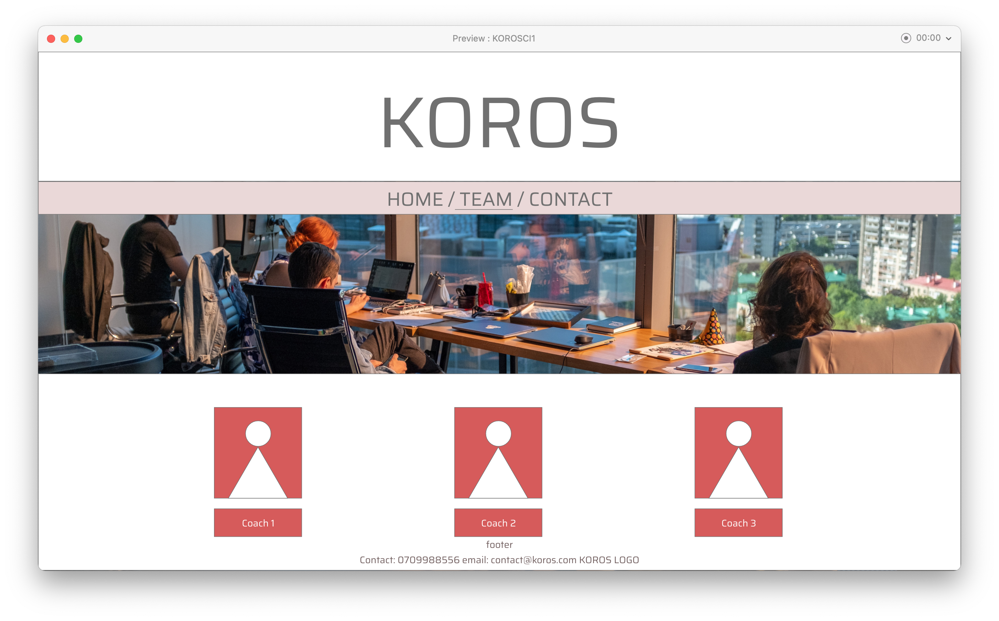
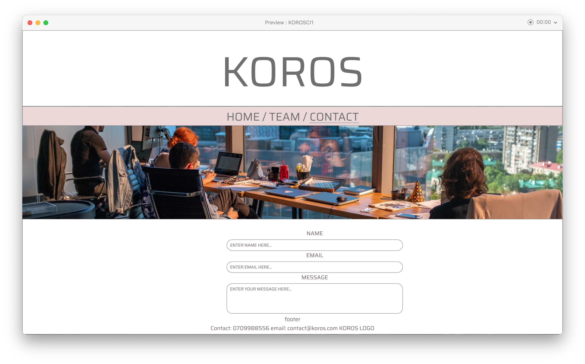

- # KOROS: Website to get in contact with coaches

Welcome to Koros

  > **NOTE:** This is a resubmission for project 1 of 5 for code institute. 

## Table of Contents

* [Table of Contents](#table-of-contents)
* [Top](#koros)
* [Description](#description)
* [Features](#features)
* [Testing](#testing)
* [Technologies](#technologies)
* [Deployment](#deployment)

  ------

  ------

## KOROS

## Description

This project is called “KOROS” and is based on HTML combined with CSS. KOROS will be a website where clients can be introduced to fitness and health coaches that operate under the KOROS brand. Here the clients can compare coaches, watch a introductory video and fill out a contact form. 

### Wireframes
The wireframes were developed using ADOBE XD. They seem detailed but their main purpose is to only display the different functions. Thus, the final design, fonts, and colors will differ. 
#### *Wireframe 1*
* Startpage showcasing hero image, head navigation where the active page is underlined. As well as introductory rpagraph, welcoming the user. 

#### *Wireframe 2*
* The website will feature videos that can be played by the visitor, this will be either a introductory video or the coaches themselves will have their own videos as presentations. 

#### *Wireframe 3*
* The coaches will have a section of the website dedicated to their presentation and skills. With a picture of them.

#### *Wireframe 4*
* The visitor should have a dedicated part of the website at which they can fill out a form to get in contact with the coaches.

## Features

### User Stories
#### *User Story 1*
* This user is interested in browsing the available coaches and compare them to each other. 

#### *User Story 2*
* This user is interested in a visual way of getting to know the coaches.

#### *User Story 3*
* This user would like to have the opportunity to get in touch with the coaches via email. 

### Planned Features

The websites following features will be explained here:-

1. Easy way to introduce KOROS for the visitor.

2. Overview of the available coaches.

3. Sticky menu for easy navigation.

4. Seperate pages for detailed information about the coaches.

5. The ability to play videos. 

6.  Footer with internal and external links.

7. Contact form for clients to get in touch and receive help.

## Testing

### Testing Features

#### *Feature 1*
As the visitor scrolls down they are greeted by a "about us" text and instructions on how to proceed. 

##### *Feature 2*
There is a dedicated section called "Meet the team" where thre current coaches are presented. They ar epresented using boxes, the boxes convey a lot of information in a tight space. The coach name, picture and speciality in form of an icon is presented to the user. If they press the box they are taken to the coaches dedicated page.

##### *Feature 3*
On the main page the header is sticky with internal links connected to the different sections of the mainpage. Having the header sticky doesnt lend itself well to the dedicated coach pages. Firstly because links are not that relevant, secondly it takes up a portion of th escreen to convey ifnormation toteh user that is not neccesarily requested at that time. 

##### *Feature 4*
When the user presses on one of the coaches they are redirected to their individual page. 

##### *Feature 5*
Each coach have their own introduction video that is found via their dedicated page. The video is delivered via embedding and iframe. 

##### *Feature 6*
The footer features links to navigate on the main page and direct links to the coaches.

##### *Feature 7*
The final section of the man apge features a contact form where client scan leave the most essential information so the coaches acna efficiently help them. 

### Testing The User Cases

##### *User Case 1*
The user will find the coaches next to each other as well as an icon that displays their speciality in order to quickly grasp the profile of the coach. 

##### *User Case 2*
The user can find a video on the each dedicated apge for the coaches that has a video of them explaining tehri approach to training and ho they can help a client. 

##### *User Case 3*
At the bottom of the page the clients can find a contact form and if they wish to simply jsut send an email they can find a email adress in the footer. 

How I have tested the website:
* The website..

### Validators
* HTML- tested with https://validator.w3.org/

* CSS- tested with https://jigsaw.w3.org/css-validator

#### Solved bugs

* The third image on the main page (index.html) was overlapping the contact form. The solution was to change the image to a float type instead." float: left ".
* When entering either of the individual coach page, the menu hrefs had to be adjusted as it is linked to sections of the main page. For example had to change #about-us to index.html#about-us. 

## Technologies

* CSS
* HTML5

## Deployment

## Citations

*  Love running project. 
*  w3 school for button. 
* Boxes that we used. 
* https://unsplash.com/photos/20jX9b35r_M main page photo
